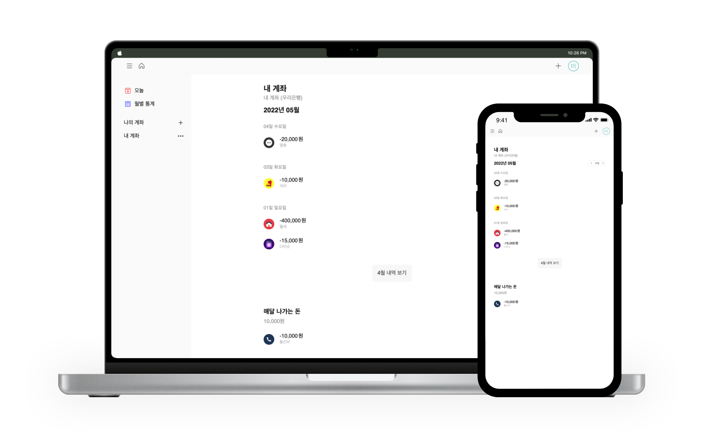

# 체크머니 (Check Money)

## Introduction

**나의 소비 습관을 파악하기 위한 서비스 입니다.**

- 지출이 발생할 때마다 사용 금액 및 사용처를 입력하여 저장
- 저장된 데이터들을 기반으로 **월별/카테고리별 지출 내역**을 정리하여 표시

[보러가기](https://check-money.netlify.app/)

## Features

### Auth

구글 로그인 및 이메일 로그인을 지원합니다.

회원가입과 비밀번호 찾기는 이메일 인증 진행 후 가능합니다.

### Main

오늘/월별 지출 및 수입 리스트 조회

### 지출 내역 분석

지출 내역을 막대그래프와 원형그래프를 이용해 다양한 방식으로 정리하여 보여줍니다.

본인이 가장 많이 지출하는 카테고리, 월 또는 일 평균 소비 정도 등을 한 눈에 확인할 수 있습니다.

### 지출/수입 내역 조회 및 등록

지갑을 여러 개 추가하여 지출 내역을 구분할 수 있습니다.

오늘/월별로 거래 내역을 확인할 수 있습니다.

### 유저 정보 수정

유저의 프로필 사진, 이름 및 비밀번호 변경이 가능합니다.

## SkillStacks

- [React](https://reactjs.org/)
- [TypeScript](https://www.typescriptlang.org)
- [Styled Components](https://styled-components.com/)
- [React Query](https://react-query.tanstack.com/)
